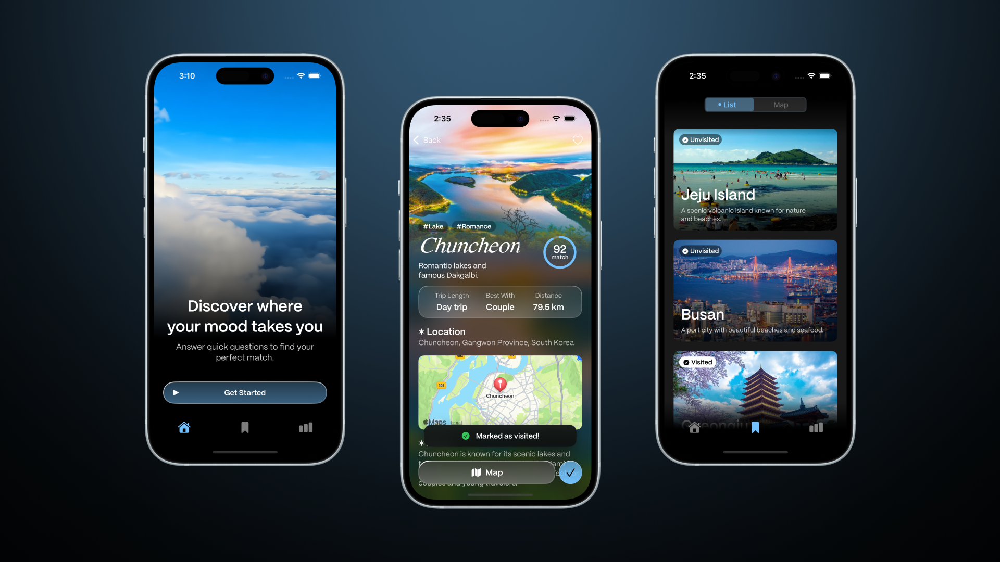
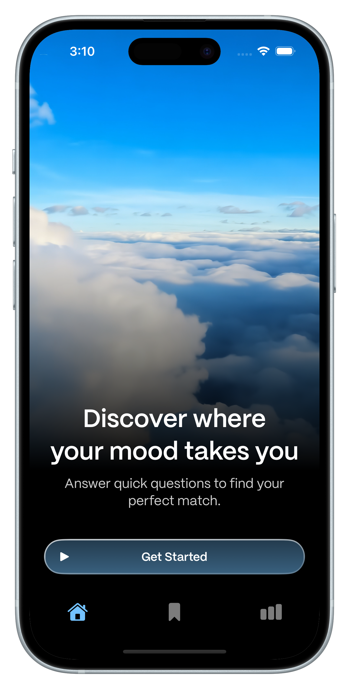
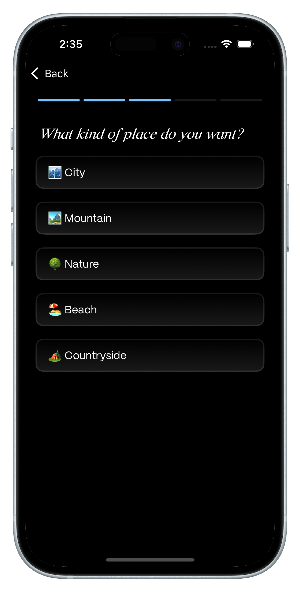
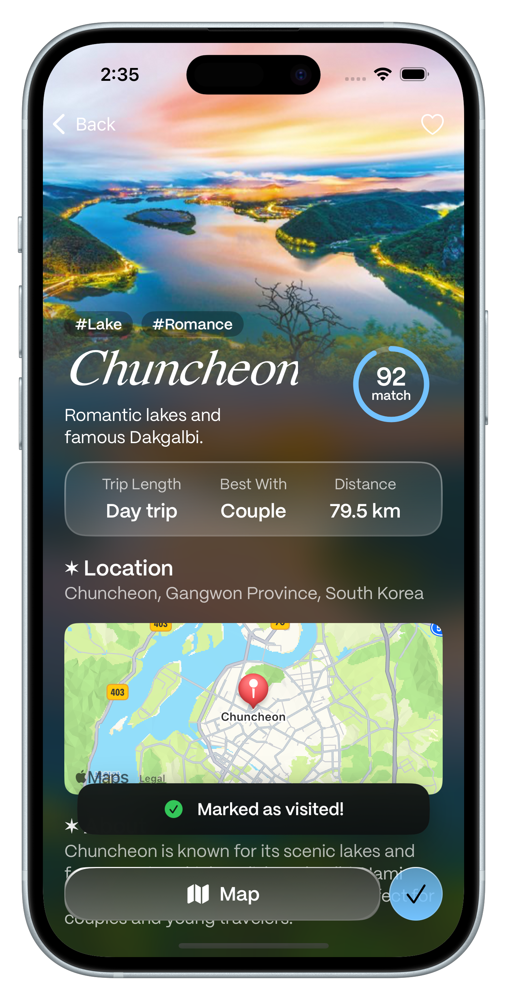
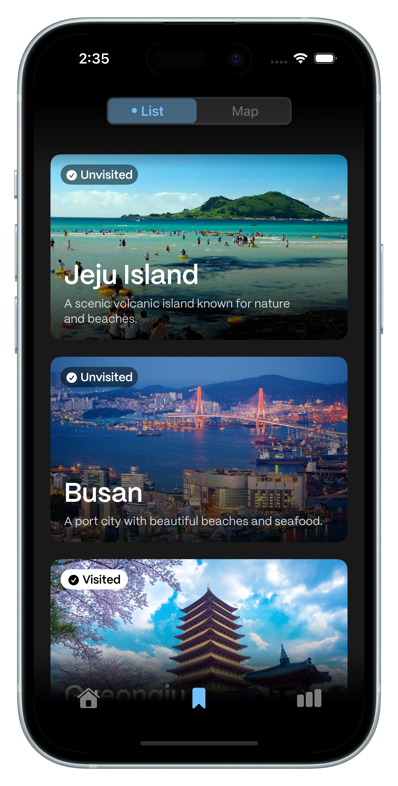
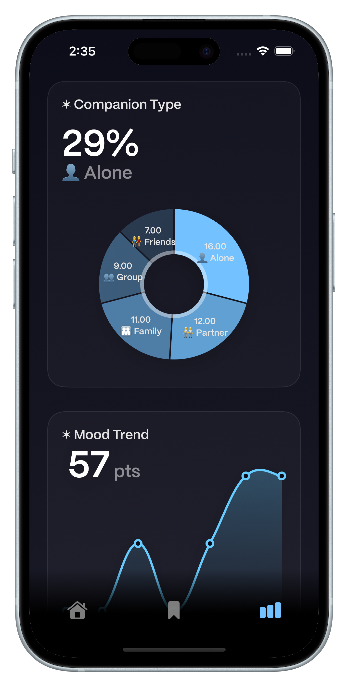

# 🗺 MoodTrip - 감정 기반 국내 여행 추천 앱



> 감정을 기준으로 국내 여행지를 추천하는 감성 기반 iOS 앱 **MoodTrip** 은 사용자의 감정 유형을 바탕으로 가장 잘 어울리는 여행지를 찾아주고, 인사이트 시각화 기능까지 제공하는 퍼스널 여행 추천 서비스입니다.
>
> 설문 기반 매칭과 여행 후 기록, 그리고 인사이트 차트를 통해 나만의 여행 감성을 발견해보세요.

---

## 🎯 주요 기능

| ✨ 메인 화면 | 🗺 지도 연동 |
|:------------:|:--------------:|
|  |  |

| ⭐️ 감정 설문 | 📍 여행지 추천 |
|:-----------:|:---------------:|
|  |  |

| 🔖 방문 체크 / 즐겨찾기 | 📊 인사이트 |
|:----------------------:|:-----------------:|
|  |  |

---

## 🛠️ 사용 기술

| 구분           | 기술 스택                                |
| ------------ | ------------------------------------ |
| **Frontend** | Swift / UIKit / MapKit / DGCharts    |
| **UI 구성**    | 코드 기반 뷰 구성 (Storyboard 미사용), 다크모드 대응 |
| **데이터 저장**   | UserDefaults 기반 간단 저장                |
| **차트 시각화**   | DGCharts 기반 감정 분석 차트 시각화             |

---

## 🧠 감정 설문 기반 추천 알고리즘

* 감정 설문 5\~7개 항목에 대해 점수 입력
* 점수 기반으로 각 여행지에 대해 매칭률 계산
* 가장 높은 매칭률 순으로 여행지 정렬
* 매칭률 원형 인디케이터로 시각화 제공


## 🗺 시스템 구조

```
사용자 → 감정 설문 → 매칭 점수 계산 → 추천 장소 화면
                               ↓
                             인사이트 저장 및 분석 (UserDefaults)
                               ↓
                             인사이트 차트 및 히스토리 시각화
```

---

## 🧑‍💻 개발 기여

| 이름        | 역할                | 주요 기여                                                               |
| --------- | ----------------- | ------------------------------------------------------------------- |
| Hyunju Cho | iOS 개발, UI/UX 디자인 | 전체 앱 설계, 감정 기반 추천 로직, UI 디자인 및 코드 구현, 차트 시각화, UserDefaults 저장 구조 설계 |

---

## 📌 향후 업데이트 계획

* CloudKit 기반 사용자 데이터 백업 기능
* 위치 기반 날씨 정보 연동
* 감정 히스토리 분석 고도화

---

## 📮 문의 및 피드백

* 이메일: [hyynjju@gmail.com](mailto:hyynjju@gmail.com)
* 인스타그램: [@hyynjju](https://www.instagram.com/hyynjju)

감정을 기록하고 나만의 여행 스타일을 발견해보세요. 당신만의 MoodTrip이 기다리고 있습니다. 🌈
